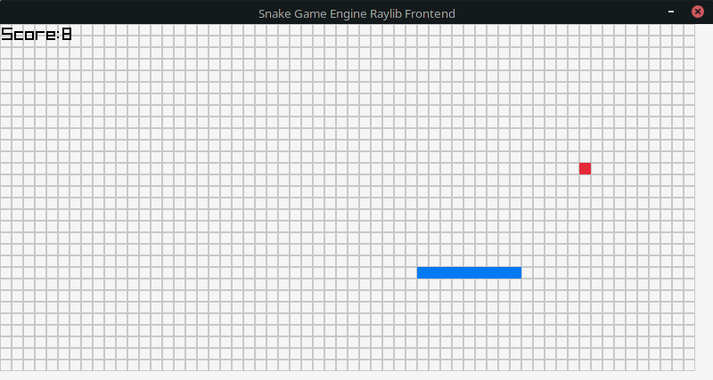

# Snake Game Engine

This is a C++ library that makes it easier to create [Snake games](https://en.wikipedia.org/wiki/Snake_(video_game_genre)) (like the one that came with Nokia phones).  The library only implements the backend game logic, so it can be paired with any graphics framework to create a frontend.  An example of how to use the library with [raylib](https://www.raylib.com/index.html) is included in `raylib_example.cpp`.

## Usage

The library is contained in `snake.cpp` and `snake.h`.  The only dependancies are the `inttypes.h`, `time.h`, `stdlib.h`, `vector` and `utility` standard libraries.  The library is used like this:

```c++
double update_time = 0.1;         // the number of seconds between updates / the snake moving
double last_update_time = 0;      // time since the last update
int snake_grid_width = screenWidth / snake_width;         // width of each column in pixels
int snake_grid_height = screenHeight / snake_height;      // width of each row in pixels

// initalise snake
SnakeGame snake(snake_width, snake_height);

// main loop
while(true)
{
    // update snake periodically
    if (GetTime() - last_update_time > update_time)
    {
        snake.update();
        last_update_time = GetTime();
    }

    // set snake direction
    if (IsKeyPressed(KEY_UP) || IsKeyPressed(KEY_W))        snake.setSnakeDirection(SNAKE_DIRECTION_UP);
    if (IsKeyPressed(KEY_DOWN) || IsKeyPressed(KEY_S))      snake.setSnakeDirection(SNAKE_DIRECTION_DOWN);
    if (IsKeyPressed(KEY_LEFT) || IsKeyPressed(KEY_A))      snake.setSnakeDirection(SNAKE_DIRECTION_LEFT);
    if (IsKeyPressed(KEY_RIGHT) || IsKeyPressed(KEY_D))     snake.setSnakeDirection(SNAKE_DIRECTION_RIGHT);

    // reset game
    if (IsKeyPressed(KEY_R)) snake.reset();

    // draw snake grid (the background grid)
    for (int y = 0; y < snake.getGridHeight(); y++)
    {
        for (int x = 0; x < snake.getGridWidth(); x++)
        {
            DrawRectangleLines(x * snake_grid_width, y * snake_grid_height, snake_grid_width, snake_grid_height, LIGHTGRAY);
        }
    }

    // draw snake segments
    std::vector<std::pair<int16_t, int16_t>> segments = snake.getSnakeSegments();
    for (std::pair<int16_t, int16_t> segment : segments)
    {
        DrawRectangle(
            segment.first * snake_grid_width, 
            segment.second * snake_grid_height, 
            snake_grid_width, snake_grid_height, BLUE
        );
    }

    // draw food
    std::vector<std::pair<int16_t, int16_t>> food = snake.getFood();
    for (std::pair<int16_t, int16_t> f : food)
    {
        DrawRectangle(
            f.first * snake_grid_width, 
            f.second * snake_grid_height, 
            snake_grid_width, snake_grid_height, RED
        );
    }

}

```

The current score can be retrieved using `SnakeGame::getScore()`.
When the snake reaches the edge of the grid, it can either loop round to the other edge of the screen, or cause a game over (which is default).  This setting can be configured using `SnakeGame::setLoopAtEdge()`.  When the snake collides with itself, the game will end, although this behaviour can be disabled using `SnakeGame::setCollideWithSnake()`.

## Raylib Example



The file `raylib_example.cpp` contains an example of how to use this library with raylib.  It makes use of most of the methods exposed by the library.  To compile it, run `g++ -o snake snake.cpp raylib_example.cpp $(pkg-config --libs raylib) -g` (I've only tested this on Linux).  To play the game, use these controls:

| Keys                  | Action                |
|-----------------------|-----------------------|
| WASD or arrow keys    | Move the snake        |
| R                     | Reset the game        |
| P                     | Pause the game        |
| Esc                   | Close the game        |